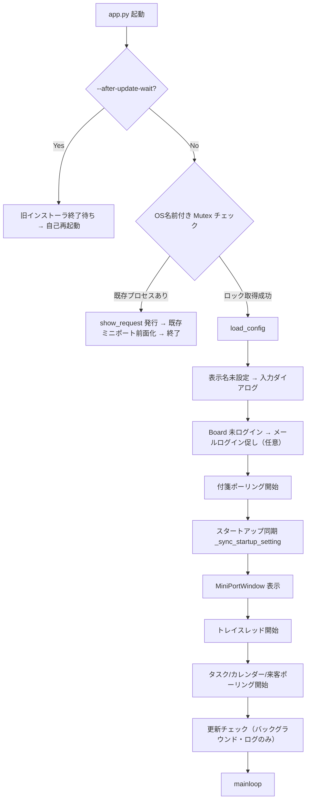

# Wonder Linko Desktop App (DT_APP)

社員 PC に常駐する「Personal Linko Agent」。**タスクトレイ常駐**＋起動時に **ミニポート**（付箋クイック投稿）を表示し、付箋ボード・Board System パーソナル・linko-system と連携します。

来客通知・リン子アバター・ブレスト・タスク/カレンダーリマインド・顔/音声セルフ登録などは **`features.*` で任意に ON**（機能フラグは既定すべて OFF。`brainstorm_voice` のみ既定 ON）。

> **現行バージョン:** `version.py` の `__version__` で一元管理（現行 **v3.9.8**）。MSI ビルドと自動更新チェックがこの値を参照します。

---

## 開発環境と利用環境

| 区分 | 環境 |
| :--- | :--- |
| **開発** | Windows または Linux。`pip install -r requirements.txt` は Linux でも実行可能（Windows 専用パッケージは自動スキップ）。**MSI ビルドは Windows のみ**。 |
| **配布先** | **Windows 10/11**（トースト通知・MSI インストール・スタートアップ登録・音声再生に対応）。 |
| **Mac / Linux** | トレイ・ミニポート・API 連携は動作しますが、トースト・音声・自動更新・スタートアップはコンソール出力または無効化。 |

---

## アーキテクチャ概要

```
┌─────────────────────────────────────────────────────────────┐
│  app.py（メインスレッド: MiniPortWindow.mainloop）              │
│  ├─ mini_port.py      フローティング UI・付箋クイック投稿      │
│  ├─ settings_dialog.py 設定（完全自動保存・即時反映）           │
│  ├─ chat_panel.py     ブレスト（SSE ストリーミング / 音声 / 添付） │
│  └─ *\_dialog.py      タスクリマインド（期限バッジ付） / 顔・音声登録 │
├─────────────────────────────────────────────────────────────┤
│  pystray トレイ（バックグラウンドスレッド）                     │
├─────────────────────────────────────────────────────────────┤
│  バックグラウンドポーリング（daemon スレッド）                  │
│  ├─ postit_poll.py             付箋新着監視                     │
│  ├─ task_remind_client.py      Today タスクリマインド           │
│  ├─ calendar_notify_client.py  カレンダーリマインド             │
│  ├─ visitor_notify_client.py   来客 Socket.IO 監視              │
│  ├─ show_request_watcher       前面化シグナル監視               │
│  └─ update_checker.py          起動時自動更新チェック           │
└─────────────────────────────────────────────────────────────┘
         │                    │                    │
         ▼                    ▼                    ▼
   付箋ボード API       Board System API      linko-system
   (sticky_notes)        (/api/bs/...)         (Socket.IO / TTS / 顔音声)
```

---

## 起動フローと排他制御



### 1. 多重起動防止の最新仕様（課題4対応）

- Windows では OS名前付き Mutex（`Local\WonderLinko.Desktop.SingleInstance`）を使用。
- OS がプロセス終了時にハンドルを自動解放するため、クラッシュ時でもロックファイルの残留ゴミ問題が発生しません。
- 重複起動されたプロセスは `show_request` ファイルを生成して即座に終了し、先発プロセスがそれを検知してミニポートを最前面化します。

### 2. トースト通知と自前 UI フォールバック（課題3対応）

- Windows 標準トースト通知（`winotify`）を優先使用。
- ユーザーが Windows の集中モード（応答不可）を有効にしている場合や、PowerShell 実行ポリシー・セキュリティソフトによる通知ブロックが発生した場合は、**`customtkinter` による自前フローティング通知ウィンドウ** へ自動フォールバック。
- フォーカスを奪わず（`takefocus=False`）、連続通知時は古いものを閉じるスタッキング排他制御を実装。

### 3. スタートアップ登録と OS 状態同期（改善計画18）

- Windows のスタートアップフォルダ（`shell:startup`）へのショートカット配置により自動起動を実現。
- タスクマネージャーでの無効化状態（`StartupApproved`）と双方向で同期し、ユーザーが OS 側で無効化した場合はアプリ側が勝手に再有効化しない安全設計を採用。

### 4. 設定画面の完全自動保存（改善計画18）

- 「保存」「キャンセル」ボタンを廃止。
- チェックボックスや選択肢の変更、入力フィールドからのフォーカスアウト／Enter キー押下時に即座に `config.json` へ保存・反映。

---

## 常時動作（設定不要・既定 ON）

| 機能 | 操作 / トリガー | 処理 | 連携先 |
| :--- | :--- | :--- | :--- |
| **ミニポート** | 起動時に表示。✕ / 右クリックで非表示 | 付箋テキスト入力・クイック投稿（Ctrl+Enter対応） | 付箋ボード `POST /api/sticky_notes` |
| **パーソナルボード** | 「ボード」クリック | ブラウザで `/boards/personal/{id}` を開く | 未ログイン時 `GET /users/by_email` |
| **付箋新着通知** | 60 秒間隔ポーリング（`0` で無効） | 付箋数や更新日時の変化を検知してトースト通知 | 付箋ボード `GET /api/boards/{id}/summary` |
| **タスクトレイ** | 左クリック「開く」 | `tray_click_action`（付箋 / パーソナル / 最後のお知らせ） | — |
| **通知 ON/OFF** | ミニポート 🔔 / 右クリック | アプリ内通知総合スイッチをトグル | ローカル `config.json` |
| **前面化** | トレイ「ミニポートを表示」/ 重複起動時 | ミニポートを最前面表示 | — |
| **PC 起動時自動起動** | 既定 ON（初回自動登録・OS同期） | スタートアップフォルダ（ショートカット） | Windows のみ |
| **自動更新チェック** | 起動時 1 回 | 更新があってもダイアログは出さずログのみ | `update_check_url` |

---

## 任意機能（`features.*`）

設定ダイアログから ON/OFF を切り替え可能。**既定は OFF**（`brainstorm_voice` のみ **ON**）。

| キー | 既定 | 有効時の動作 | 前提条件 |
| :--- | :---: | :--- | :--- |
| `linko_avatar` | OFF | ミニポートをマスコットレイアウト（264×224）に変更。リン子アバター・吹き出し表示 | — |
| `visitor_notify` | OFF | linko-system へ Socket.IO 接続し、来客時にトースト通知 | `linko_server_url`、社内 LAN |
| `visitor_notify_sound` | OFF | 来客通知時に受付と同じチャイム音を再生 | `visitor_notify` ON、Windows |
| `brainstorm` | OFF | アバタークリックでリン子とのブレストチャットパネルを開く（SSE ストリーミング、Ctrl+Enter 送信、資料添付） | `board_system_url`、Board ログイン |
| `brainstorm_voice` | **ON** | ブレスト応答を文単位で音声合成・再生（TTS） | `brainstorm` OFF なら無効 |
| `task_remind` | OFF | Today タスクの定時リマインド（**期限警告バッジ付**） | `board_system_personal_id` |
| `calendar_notify` | OFF | Google カレンダー連携ユーザーの予定を N 分前に通知 | 同上 + Google 連携 |
| `calendar_create` | OFF | ブレスト中の予定登録提案 → 確認 UI → Google カレンダー自動登録 | 同上 + Google 連携 |
| `remind_voice` | OFF | タスク/カレンダーリマインドを音声合成で読み上げ | `linko_server_url` |
| `face_registry_manage` | OFF | 管理者向け社員・顔・音声名簿管理画面 | `linko_admin_token` |
| `face_registry_self` | OFF | メール OTP による顔データ登録（Web カメラ） | 名簿にメール登録済み |
| `voice_registry_self` | OFF | メール OTP による声紋データ登録（マイク） | 顔登録と共通 OTP |

### タスクリマインドダイアログの期限表示（改善計画8対応）

タスクリマインドダイアログ（`TaskRemindListDialog`）では、Webフロントエンドと統一された期限警告ラベルが表示されます:

- ⚠️ 期限切れ（X日経過）: 赤色
- 🔥 本期日が期限！: オレンジ色
- ⏰ 期限まであとX日: 黄色
- 📅 期限まであとX日: 青色

---

## 設定（`config.json`）

設定ファイルの保存先は `%LOCALAPPDATA%\WonderLink\config.json` です。  
未配置の場合は初回起動時に自動生成されます。**MSI には `config.json` を同梱しないため、上書きインストールでユーザー設定が初期化されることはありません。**

### 主要キー

| キー | 説明 |
| :--- | :--- |
| `board_system_url` | Board System API のベース URL（例: `https://wlboardsys.internal.wonder-link.com/api/bs`） |
| `board_system_personal_id` | メールログイン後に自動保存されるパーソナルユーザー ID |
| `mini_port_api_url` | ミニポート付箋投稿先（例: `https://wlboardsys.internal.wonder-link.com/api/sticky_notes`） |
| `linko_server_url` | linko-system URL（例: `https://linkosys.internal.wonder-link.com`） |
| `task_remind_times` | タスクリマインド時刻（例: `["13:00", "17:00"]`） |
| `task_remind_weekdays_only` | 平日のみリマインド（true/false） |
| `calendar_remind_minutes_before_list` | カレンダー通知のオフセット分（例: `[15, 5]`） |
| `update_check_url` | 自動更新確認用 JSON の URL |
| `features` | 上記機能フラグの辞書 |

---

## 配布・インストール・アンインストール

### 1. 新規インストール（ユーザー向け）

1. 配布された ZIP ファイルをすべて展開（解凍）します。
2. フォルダ内の `install.bat` を右クリックして実行（管理者権限）。
3. 自動的に社内自己署名証明書（`cert/WonderLink_InternalRoot.cer`）が登録され、MSI のサイレントインストールが行われます。

### 2. 完全アンインストール（改善計画19対応）

アンインストール時は、配布物内の **`scripts\uninstall.bat`** を実行してください。
以下のクリーンアップが一括実行されます:

1. 実行中の `WonderLinko.exe` プロセスを安全に終了（WM_CLOSE 送信 → 強制終了）
2. 全ユーザープロファイルのスタートアップフォルダからショートカットを確実に削除
3. MSI パッケージのサイレントアンインストールを実行

---

## 開発者向け：ビルドとリリース

### 1. 署名証明書の作成（初回のみ）

```powershell
.\scripts\generate_cert.ps1
# エクスポート用パスワードを入力 → プロジェクトルートの .env に CERT_PASSWORD=パスワード を設定
```

### 2. MSI パッケージのビルド

```powershell
.\build_msi.ps1
# → dist\WonderLinko.msi が生成され、バイナリおよび MSI にコード署名が自動付与されます
```

### 3. 本番サーバへの配信

生成された `dist\WonderLinko.msi` を本番サーバの `board-system/backend/desktop_app_releases/` へ転送し、`latest.json` のバージョンを更新します（詳細は [desktop_app_releases/README.md](../board-system/backend/desktop_app_releases/README.md) 参照）。
