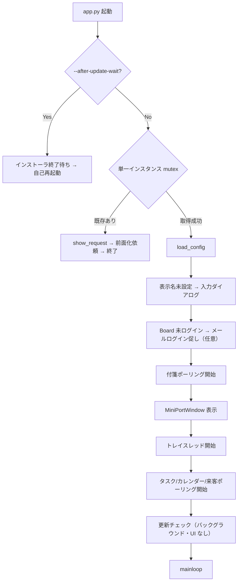

# Wonder Linko Desktop App (DT_APP)

社員 PC に常駐する「Personal Linko Agent」。**タスクトレイ常駐**＋起動時に **ミニポート**（付箋クイック投稿）を表示し、付箋ボード・Board System パーソナル・linko-system と連携する。

来客通知・リン子アバター・ブレスト・タスク/カレンダーリマインド・顔/音声セルフ登録などは **`features.*` で任意に ON**（機能フラグは既定すべて OFF。`brainstorm_voice` のみ既定 ON）。

> **バージョン:** `version.py` の `__version__` で一元管理（現行 **v3.9.3**）。MSI ビルドと自動更新チェックがこの値を参照する。

---

## 開発環境と利用環境

| 区分 | 環境 |
| ------ | ------ |
| **開発** | Linux または Windows。`pip install -r requirements.txt` は Linux でそのまま実行可能（Windows 専用パッケージは自動スキップ）。**MSI ビルドは Windows のみ**。 |
| **配布先** | **Windows 10/11** 推奨（トースト・MSI・スタートアップ登録・音声再生は Windows のみ）。 |
| **Mac / Linux** | トレイ・ミニポート・API 連携は動作するが、トースト・音声・自動更新・スタートアップは無効またはフォールバック。 |
| **モバイル** | デスクトップアプリは使わず、Board System のパーソナル等をブラウザで開く。 |

---

## アーキテクチャ概要

```
┌─────────────────────────────────────────────────────────────┐
│  app.py（メインスレッド: MiniPortWindow.mainloop）              │
│  ├─ mini_port.py      フローティング UI・付箋投稿・ホットキー   │
│  ├─ settings_dialog.py  設定・機能フラグ・リマインド時刻        │
│  ├─ chat_panel.py     ブレスト（SSE）・資料添付・カレンダー登録  │
│  └─ *\_dialog.py      タスクリマインド / 顔・音声登録           │
├─────────────────────────────────────────────────────────────┤
│  pystray トレイ（別スレッド）                                   │
├─────────────────────────────────────────────────────────────┤
│  バックグラウンド（daemon スレッド）                            │
│  ├─ postit_poll.py           付箋新着監視                       │
│  ├─ task_remind_client.py    Today タスクリマインド             │
│  ├─ calendar_notify_client.py  カレンダーリマインド             │
│  ├─ visitor_notify_client.py   来客 Socket.IO                 │
│  └─ update_checker.py        起動時更新チェック（1 回）         │
└─────────────────────────────────────────────────────────────┘
         │                    │                    │
         ▼                    ▼                    ▼
   付箋ボード API      Board System API      linko-system
   (sticky_notes)       (/api/bs/...)         (Socket.IO / TTS / 顔音声)
```

### 主要モジュール

| モジュール | 役割 |
| ----------- | ------ |
| `app.py` | 起動シーケンス、単一インスタンス、トレイ、各ポーリング起動 |
| `config_loader.py` | `config.json` 読み書き、環境変数マージ、`features` ヘルパ |
| `mini_port.py` | ミニポート UI、付箋 POST、パーソナルボードを開く |
| `notifications.py` | Windows トースト、最後のお知らせ URL 保持 |
| `linko_avatar.py` / `speech_bubble.py` | 2D アバター（11 ポーズ・口パク・アイドル） |
| `remind_notify.py` | タスク/カレンダー通知のトースト・吹き出し・TTS 統一配信 |
| `audio_player.py` | WAV 再生、`linko_server_url/api/v2/tts` による読み上げ |
| `security.py` | 外向き URL ホワイトリスト、`webbrowser.open` ガード |
| `update_checker.py` / `startup.py` | MSI 自動更新、Windows スタートアップ登録 |

---

## 起動フロー



**Windows MSI 初回起動時:** スタートアップ未登録ならレジストリに自動登録し、トーストで通知。

**単一インスタンス:** 2 回目以降の起動は新プロセスを起動せず、既存インスタンスのミニポートを前面化する。

---

## 常時動作（設定不要・既定 ON）

| 機能 | 操作 / トリガー | 処理 | 連携先 |
| ------ | ---------------- | ------ | -------- |
| **ミニポート** | 起動時に表示。✕ / 右クリックで非表示 | 付箋テキスト入力・投稿 | `POST …/api/sticky_notes` |
| **付箋投稿** | 「投稿」または Ctrl+Enter | `display_name` 付きで POST | `mini_port_api_url` から base 導出 |
| **パーソナルボード** | 「ボード」クリック | ブラウザで `/boards/personal/{id}` を開く | 未ログイン時 `GET …/users/by_email` |
| **付箋新着通知** | 60 秒間隔ポーリング（`0` で無効） | 件数/更新時刻変化 → トースト | `GET …/api/boards/{id}/summary` |
| **タスクトレイ** | 左クリック「開く」 | `tray_click_action` に従い URL を開く | 付箋 / パーソナル / 最後のお知らせ |
| **通知 ON/OFF** | ミニポート 🔔 / 右クリック | `notifications_enabled` をトグル | ローカル config のみ |
| **設定** | トレイ「設定…」/ ミニポート ⚙ | `open_settings_dialog()` | — |
| **前面化** | `Ctrl+Shift+Space`（pynput） | ミニポートを前面表示 | — |
| **表示名** | 初回起動時 | 付箋投稿者名を入力・保存 | `display_name` |
| **Board ログイン** | 初回起動時（任意） | メール → personal_id 保存 | `board_system_personal_id` 等 |
| **PC 起動時自動起動** | MSI 初回 / 設定チェックボックス | レジストリ Run キー | Windows のみ |
| **自動更新チェック** | 起動時 1 回 | 更新あっても **ダイアログは出さない**（ログのみ） | `update_check_url` |

### トレイメニュー（最小構成）

| メニュー | 動作 |
| ---------- | ------ |
| **開く**（デフォルト） | `tray_click_action`: 付箋ボード / パーソナル / 最後のお知らせ |
| **設定…** | 設定ダイアログ |
| **ミニポートを表示** | 非表示中のミニポートを再表示 |
| **終了** | アプリ終了 |

> 通知 ON/OFF・アップデート確認・Board ログイン・機能フラグは **ミニポート / 設定画面** に集約済み（旧トレイメニュー項目は削除）。

### ミニポート右クリックメニュー

通知 ON/OFF・設定…・ミニポートを非表示

---

## 任意機能（`features.*`）

すべて設定ダイアログで ON/OFF。**既定は OFF**（`brainstorm_voice` のみ **ON**）。

| キー | 既定 | 有効時の動作 | 前提 |
| ------ | ------ | ------------- | ------ |
| `linko_avatar` | OFF | ミニポートをマスコットレイアウト（264×224）。アバター・吹き出し・口パク | — |
| `visitor_notify` | OFF | linko-system へ Socket.IO 接続、`visitor_arrived` → トースト | `linko_server_url`、社内 LAN |
| `visitor_notify_sound` | OFF | 来客時に受付と同じ WAV を再生 | `visitor_notify` ON、Windows |
| `brainstorm` | OFF | アバタークリック → ブレストチャットパネル（SSE） | `board_system_url`、Board ログイン推奨 |
| `brainstorm_voice` | **ON** | ブレスト応答を文単位 TTS 読み上げ | `brainstorm` OFF なら実質無効 |
| `task_remind` | OFF | Today タスクを定時リマインド | `board_system_personal_id` |
| `calendar_notify` | OFF | Google 連携済みユーザーの予定を N 分前に通知 | 同上 |
| `calendar_create` | OFF | ブレスト中に予定登録を提案 → 確認 UI → Google カレンダー | 同上 + Google 連携 |
| `remind_voice` | OFF | タスク/カレンダーリマインドを TTS 読み上げ | `linko_server_url` |
| `face_registry_manage` | OFF | 管理者向け社員・顔・音声名簿管理 | `linko_admin_token` |
| `face_registry_self` | OFF | メール OTP → 顔 3 枚登録 | linko 名簿にメール登録済み |
| `voice_registry_self` | OFF | 同一 OTP → 声紋 3 回登録 | 顔登録と共通 OTP |
| `taskbar_mode` | OFF | **設定 UI にのみ存在（コード未参照・未実装）** | — |

`visitor_notify` の ON/OFF 変更は設定保存時に Socket.IO 接続を即時切替する。

---

## 機能別フロー

### 付箋新着通知

```
postit_poll（max(10, postit_poll_interval_sec) 秒）
  → GET {postit_board_url}/api/boards/{id}/summary
  → notesCount / lastNoteAt が変化
  → トースト「新しい付箋が投稿されました」（クリックでボード URL）
```

監視対象: `postit_board_ids`（未設定時は `postit_board_id` のみ）。

### 来客通知（`visitor_notify`）

```
Socket.IO connect(linko_server_url)
  → event "visitor_arrived" { title, message, click_url, audio_url }
  → トースト（クリックで click_url、未設定時 /entrance）
  → [visitor_notify_sound] play_linko_audio(audio_url)
```

接続失敗時は 5→10→20→30 秒のバックオフで再接続。

### タスクリマインド（`task_remind`）

```
poll 30 秒
  → JST で active_slot_now（task_remind_times の各時刻 ±15 分）
  → 平日のみ / 休止日 / 通知 OFF / 未ログイン → スキップ
  → GET /api/personal/{owner}/task_reminders/pending?slot=
  → POST .../shown_slot
  → ダイアログ表示（継続 / 完了 / 相談）
  → deliver_remind（トースト + remind_voice または linko_avatar 吹き出し）
  → POST .../ack (continue|done)
  → [相談 + brainstorm] open_chat_panel_with_task
```

設定: `task_remind_times`（カンマ区切り複数可）、`task_remind_weekdays_only`、設定画面「今日はタスクリマインドを止める」。

### カレンダーリマインド（`calendar_notify`）

```
poll 60 秒
  → calendar_remind_minutes_before_list の各 offset（例 [15, 5]）ごとに
     GET /api/personal/{owner}/calendar_reminders/pending?minutes_before=
  → 該当予定を順次トースト表示（複数件は 12 秒間隔）
  → POST .../calendar_reminders/shown?minutes_before=
  → deliver_remind
```

Google API はデスクトップから直接呼ばない。Board System サーバ側で Google 連携。

### ブレスト（`brainstorm`）

```
アバタークリック → open_chat_panel()
  → POST /api/bs/brainstorm（SSE ストリーミング）
  → [calendar_create] payload に calendar_create_enabled
  → action_proposal → 確認カード → POST .../brainstorm/calendar/confirm|cancel
  → [brainstorm_voice] POST linko_server_url/api/v2/tts → WAV 再生
  → PDF/Word/テキスト添付（端末内テキスト抽出）
  → 「付箋にする」→ mini_port 経由で sticky_notes POST
```

`brainstorm` OFF 時のアバタークリックは挨拶吹き出し＋口パクのみ。

### 顔セルフ登録（`face_registry_self`）

```
設定 →「自分の顔を登録…」
  → GET  /api/face_registry/self_register/status
  → POST /api/face_registry/self_register/start {email}
  → POST /api/face_registry/self_register/verify {otp}
  → PUT  /api/face_registry/{person_id}?self_register=1 {faceData} ×3（Web カメラ）
```

### 音声セルフ登録（`voice_registry_self`）

```
設定 →「自分の声を登録…」（OTP は顔登録と共通）
  → GET  /api/face_registry/self_register/voice/challenges
  → PUT  /api/face_registry/{person_id}/voice {voiceData} ×3（マイク・チャレンジ付き）
```

### 管理者：社員・顔・音声管理（`face_registry_manage`）

```
設定 → linko 管理者トークン入力 →「社員・顔・音声の管理を開く…」
  → linko_server_url/api/face_registry/*（X-Linko-Admin-Token）
  → POST /api/workspace/directory_sync
```

---

## バックグラウンド処理一覧

| 処理 | 間隔 / 条件 | モジュール | 有効条件 |
| ------ | ------------- | ------------ | ---------- |
| 付箋ポーリング | `max(10, postit_poll_interval_sec)` 秒 | `postit_poll` | 間隔 > 0 |
| タスクリマインド | 30 秒 | `task_remind_client` | `task_remind` + personal_id + 通知 ON + スロット内 |
| カレンダーリマインド | 60 秒 | `calendar_notify_client` | `calendar_notify` + personal_id + 通知 ON |
| 来客 Socket.IO | 常時接続 | `visitor_notify_client` | `visitor_notify` |
| show_request 監視 | 1 秒 | `app.py` | 常時 |
| 更新チェック | 起動時 1 回 | `update_checker` | `update_check_url` 設定時 |
| ホットキー | 常時 | `mini_port`（pynput） | 常時 |

---

## 外部連携

### 連携先 URL（本番の目安）

| サービス | URL（例） | 用途 |
| ---------- | ----------- | ------ |
| 付箋ボード | `https://wlboardsys.internal.wonder-link.com/board/wl` | ミニポート投稿・トレイ「付箋」 |
| Board System API | `https://wlboardsys.internal.wonder-link.com/api/bs` | パーソナル・ブレスト・リマインド |
| Board System フロント | `…/boards/personal/{id}` | パーソナルボード表示 |
| linko-system | `https://linko-board.internal.wonder-link.com` | 来客 Socket.IO・TTS・顔/音声 API |
| デスクトップ更新 | `…/api/bs/desktop-app/latest.json` | MSI 自動更新 |

`config_loader.py` の defaults に本番 URL が入っている。開発時は `config.json` または環境変数で上書き。

### Board System API（主要）

| エンドポイント | 用途 |
| ---------------- | ------ |
| `GET /users/by_email` | メールログイン |
| `GET /users/{id}` | メール取得（顔/音声登録プリフィル） |
| `GET /api/personal/{owner}/task_reminders/pending` | タスクリマインド |
| `POST …/shown_slot`, `…/shown`, `…/ack` | リマインド状態 |
| `GET /api/personal/{owner}/calendar_reminders/pending` | カレンダー pending |
| `POST …/calendar_reminders/shown` | カレンダー表示済み |
| `POST /brainstorm` | ブレスト SSE |
| `POST /brainstorm/calendar/confirm\|cancel` | カレンダー予定登録 |

### linko-system API（主要）

| 連携 | 用途 |
| ------ | ------ |
| Socket.IO `visitor_arrived` | 来客通知 |
| `POST /api/v2/tts` | GPT-SoVITS 音声合成 |
| `/api/face_registry/*` | 顔・音声登録（管理/セルフ） |

---

## 設定（config.json）

未配置時は `config_loader.py` の defaults を使用。**v3.1.4 以降、MSI に `config.json` はバンドルしない**（上書きインストールで設定が消える事故を防ぐ）。

### 主要キー

| キー | 説明 |
| ------ | ------ |
| `board_system_url` | Board System API ベース |
| `board_system_personal_id` / `board_system_email` | メールログイン後に自動保存 |
| `mini_port_api_url` | ミニポート投稿先（付箋ボードと同一ホスト） |
| `linko_server_url` | linko-system（来客・TTS・顔/音声） |
| `linko_admin_token` | 管理者 API トークン（MSI 同梱しない） |
| `postit_board_id` / `postit_board_ids` | トレイで開くボード / 新付箋監視対象 |
| `postit_poll_interval_sec` | 付箋ポーリング間隔（秒、`0` で無効） |
| `tray_click_action` | `postit` / `personal` / `last_notification` |
| `notifications_enabled` | アプリ内通知総合スイッチ（OS 通知設定とは別） |
| `task_remind_times` | タスクリマインド時刻（例: `["13:00","17:00"]`、複数可） |
| `task_remind_weekdays_only` | 平日のみリマインド |
| `task_remind_paused_until` | リマインド休止日（`YYYY-MM-DD`、自動更新） |
| `calendar_remind_minutes_before_list` | カレンダー「何分前」（1〜15、複数可。例: `[15, 5]`） |
| `calendar_remind_minutes_before` | 後方互換（先頭 1 件） |
| `update_check_url` | 自動更新 JSON の URL |
| `update_network_check_url` | 起動時・ポーリング前の到達確認 URL（空なら `update_check_url` 等を自動選択。ping は使わない） |
| `update_network_check_interval_sec` / `update_network_check_max_wait_sec` | 起動時更新チェック前の到達待ち |
| `network_unreachable_backoff_sec` | CATO 未接続時、ポーリング再試行までの待ち（秒。既定 30） |
| `features` | 上表の機能フラグ |
| `security` | URL 許可リスト（`allowed_host_suffixes` 等） |

### 環境変数

`WLINKO_USER_ID`, `BOARD_SYSTEM_URL`, `LINKO_SERVER_URL`, `LINKO_ADMIN_TOKEN`, `MINI_PORT_API_URL`, `AI_BOARD_URL`, `POSTIT_BOARD_URL`

開発 LAN 例: `WLINKO_EXTRA_ALLOWED_HOSTS=172.16.1.251`, `WLINKO_ALLOW_PRIVATE_IPS=1`

本番テンプレート: `config.production.example.json`

### レガシーキー（config に残ることがあるがコード未参照）

`avatar_visible`, `sound_enabled`, `open_personal_on_start`

---

## セットアップ・起動

**Linux（開発）:**

```bash
python3 -m venv .venv
source .venv/bin/activate
pip install -r requirements.txt
python app.py
```

**Windows:**

```powershell
cd wl_desktop_app
.\start_app.ps1
```

---

## 配布

社内環境では **MSI 配布を推奨**。

| 方式 | コマンド / 備考 |
|------|-----------------|
| **MSI（推奨）** | Windows で `.\build_msi.ps1` → `dist\WonderLinko.msi` |
| 単体 exe | `.\build_exe.ps1`（許可されている環境のみ） |

ビルド前に `config.production.example.json` を `config.json` にコピーして本番 URL を確認すること（MSI には同梱されないが、開発ビルドの挙動確認用）。

---

## 自動更新

### クライアント側

1. **起動時:** `update_check_url` を GET。更新があっても UI は出さない（v3 方針・ログのみ）
2. **手動:** 設定 →「🔄 アップデート確認」→ 確認 → MSI ダウンロード・サイレントインストール → 自動再起動
3. **`--after-update-wait=PID`:** 更新バッチ完了後の再起動経路

### リリース側

1. `version.py` の `__version__` を bump
2. `board-system/backend/desktop_app_releases/latest.json` を同バージョンに更新
3. Windows: `.\build_msi.ps1` → MSI 生成
4. 本番サーバへ MSI を scp（例: `WonderLinko_3.9.3.msi`）
5. **v3.2.3 以降:** `desktop_app_releases/` は bind mount のため **git pull + scp で即反映**（通常 deploy 不要）

```json
{
  "version": "3.9.3",
  "url": "https://wlboardsys.internal.wonder-link.com/api/bs/desktop-app/WonderLinko_3.9.3.msi"
}
```

`version` と `url` の MSI ファイル名は一致させること（不一致 → 404 で更新失敗）。

詳細: `docs/v3_リリース手順.md`, `board-system/backend/desktop_app_releases/README.md`

---

## プラットフォーム差分

| 機能 | Windows | Linux / Mac（開発） |
| ------ | --------- | --------------------- |
| 配布 | MSI 本番 | 開発・検証のみ |
| 単一インスタンス mutex | ○ | スキップ |
| トースト | winotify 等 | コンソール出力 |
| 音声（winsound / TTS） | ○ | スキップ |
| スタートアップ登録 | レジストリ | 常に無効 |
| MSI 自動更新 | ○ | エラー |
| Web カメラ / マイク登録 | OpenCV / sounddevice | プラットフォーム依存 |
| 診断ログ `WonderLinko_diagnostic.txt` | frozen exe 時 | なし |

---

## セキュリティ

外向き HTTP は `security.py` のホワイトリストで制限。既定: `*.internal.wonder-link.com` + localhost。

`webbrowser.open` も同様に検証。Board personal_id は数字のみ許可。

---

## ユーザー管理

Board System の `users` テーブルと linko-system が共用。新規ユーザーは Board System 側で登録し、デスクトップの初回メール入力で紐づく。

→ `docs/ユーザーDB共用と登録方法.md`（wl-board-pj ルート）

---

## 関連ドキュメント

| ファイル | 内容 |
| ---------- | ------ |
| `docs/v3_リリース手順.md` | MSI ビルド〜本番配信 |
| `docs/v2_拡張計画.md` | `features.*` 拡張の経緯 |
| `docs/指示書_顔セルフ登録_Phase1.md` | 顔セルフ登録 |
| `docs/指示書_音声セルフ登録_Phase2.md` | 音声セルフ登録 |
| `docs/Windows通知がオフになった場合.md` | 通知トラブル |
| `docs/MSI起動エラー_デバイス側の確認.md` | MSI 起動失敗時 |
| `board-system/backend/desktop_app_releases/README.md` | 自動更新ファイル配置 |
