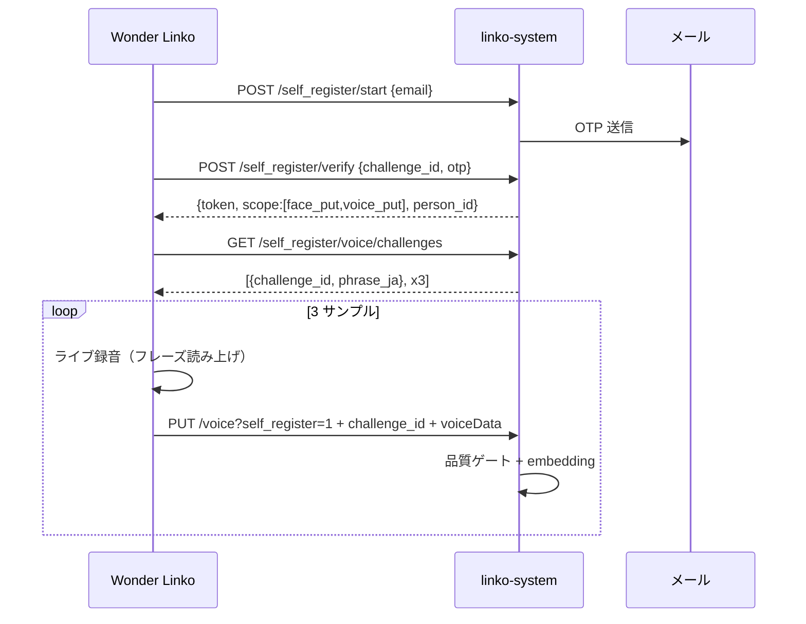

# 指示書: 音声セルフ登録 Phase 2（メール OTP 共通 + チャレンジ録音 + 音声開錠）

作成: 2026-06-01 / 対象: **linko-system**（API・話者照合・開錠）+ **wl_desktop_app**（UI）  
前提: 顔セルフ登録 Phase 1（v3.8.x）完了。管理者経路の `voiceData` 保存（WAV）は実装済みだが **話者照合エンジンは未実装**。

## 背景・目的

エントランス開錠は現状 **顔認証のみ**（`FaceService` → Alligate `remote-unlock`）。  
社員が各自 PC から **本人確認付きで声紋を登録**し、エントランスで **顔または声** で開錠できるようにする。

なりすまし対策は **開錠側（Alligate / linko）** でも入れるが、**登録経路のリスクを先に下げる**。

### 合意済み設計判断（2026-06-01）

| # | 決定内容 |
|---|----------|
| 1 | エントランス認証モード初期値: **`face_or_voice`**（顔のみ / 声のみ / 顔または声） |
| 2 | OTP: **顔と共通 1 回**（同一 challenge / verify、トークン scope を拡張） |
| 3 | セルフ登録: **チャレンジ付きライブ録音 3 サンプル**、**ファイルアップロード不可** |

---

## Phase 分割

| Phase | 内容 | 成果 |
| ------- | ------ | ------ |
| **2a** | 音声セルフ登録（OTP 共通・チャレンジ録音・embedding 保存） | 社員 PC から声紋登録 |
| **2b** | 話者照合エンジン（ECAPA-TDNN 等）本番化・閾値調整 | 照合スコアが安定 |
| **2c** | エントランス音声 verify + **`face_or_voice` 開錠** | 登録音声で開錠 |

本書は **2a を主**、2b/2c の API・設定骨格まで記載する。

---

## 全体フロー（2a: セルフ登録）

```
[社員 PC] 設定 →「自分の声を登録」（または顔登録完了後に続けて）
    → 同意チェック（音声専用文言）
    → メール入力 → POST /self_register/start   ← 顔と同一 API
    → OTP 入力   → POST /self_register/verify → self_register_token (scope に voice_put)
    → GET /self_register/voice/challenges → 3 件のチャレンジフレーズ
    → 各サンプル: フレーズ表示 → ライブ録音（約4秒）→ PUT /voice?self_register=1
    → サーバ: 品質ゲート → embedding 抽出 → voice_embeddings 追記
    → 完了
```

顔のみ / 声のみ / 両方の組み合わせ:

| パターン | OTP | トークン scope | UI |
| ---------- | ----- | ---------------- | ----- |
| 顔のみ | 1 回 | `face_put` | 既存 Phase 1 |
| 声のみ | 1 回 | `voice_put` | 本 Phase 2a |
| 両方 | **1 回** | `face_put`, `voice_put` | 顔 3 枚 → 続けて声 3 サンプル（同一セッション） |



---

## 設計原則

| 原則 | 内容 |
| ------ | ------ |
| OTP 共通 | `start` / `verify` は顔 Phase 1 と **同一エンドポイント**。サービス名は `self_register` に統合（後方互換で `self_face_registration` 設定キーは残してよい） |
| 最小権限 | トークン scope: `face_put` / `voice_put`。URL の `person_id` はトークンと一致必須 |
| ライブ録音のみ | セルフ経路は **WAV ファイル選択不可**（管理者経路のみファイル可） |
| チャレンジ必須 | 各サンプルはサーバ発行の **ランダム数字入りフレーズ** をその場で読み上げ |
| embedding はサーバ側 | クライアントは WAV のみ送信。ベクトルは linko 上で抽出 |
| 社内ネットワーク | 既存 `_ip_allowed` を流用 |
| 開錠は別 Phase | 2c で `face_or_voice`。Alligate 側 anti-spoof と役割分担 |

---

## 登録経路セキュリティ（なりすましリスク低減）

| ID | 対策 | 実装 Phase |
| ---- | ------ | ------------ |
| S1 | メール OTP（既存） | 2a |
| S2 | セルフ: ファイルアップロード不可 | 2a |
| S3 | チャレンジフレーズ（例: 「リン子、今日は **4827** と申します」） | 2a |
| S4 | 3 サンプル（チャレンジごとに数字変更） | 2a |
| S5 | サーバ品質ゲート（長さ・無音・クリッピング・最小 SNR） | 2a |
| S6 | embedding サーバ抽出のみ | 2a/2b |
| S7 | scope 限定トークン + TTL 15 分 | 2a |
| S8 | IP allowlist + レート制限 + 監査ログ | 2a |
| S9 | 音声専用 `consent_text_ja` | 2a |
| S10 | セルフ UI から登録 WAV の再生・再取得不可 | 2a |

---

## バックエンド API 仕様（linko-system）

ベース URL: `{linko_server_url}/api/face_registry`

### 設定（business_settings.json）

既存 `self_face_registration` を拡張するか、並列キー `self_voice_registration` を追加する。**OTP/SMTP/レート制限は共有**。

```json
{
  "self_face_registration": {
    "enabled": false,
    "otp_required": true,
    "otp_ttl_seconds": 600,
    "otp_max_attempts": 3,
    "token_ttl_seconds": 900,
    "staff_only": true,
    "consent_text_ja": "…顔…",
    "rate_limit_per_email_per_hour": 5,
    "rate_limit_per_ip_per_hour": 20
  },
  "self_voice_registration": {
    "enabled": false,
    "consent_text_ja": "登録する音声は、エントランス等での本人確認・開錠のために利用されます。…",
    "enrollment_samples_required": 3,
    "challenge_digits": 4,
    "min_duration_sec": 2.5,
    "max_duration_sec": 8.0,
    "max_embeddings": 5
  },
  "devices": {
    "entrance_face_unlock": { "enabled": true, "liveness": false },
    "entrance_voice_unlock": {
      "enabled": false,
      "auth_mode": "face_or_voice",
      "min_similarity": 0.72,
      "challenge_digits": 4,
      "cooldown_sec": 30,
      "max_attempts_per_minute": 5
    }
  }
}
```

| キー | 既定 | 説明 |
| ------ | ------ | ------ |
| `self_voice_registration.enabled` | `false` | 音声セルフ登録マスター |
| `consent_text_ja` | （文言） | 音声登録同意文 |
| `enrollment_samples_required` | `3` | 1 セッションで必要なサンプル数 |
| `challenge_digits` | `4` | チャレンジに埋め込む乱数桁数 |
| `max_embeddings` | `5` | 顔と同型 FIFO 上限 |
| `entrance_voice_unlock.auth_mode` | `face_or_voice` | `face_only` / `voice_only` / `face_or_voice` / `face_and_voice`（将来） |
| `entrance_voice_unlock.min_similarity` | `0.72` | 開錠閾値（登録より厳しめにチューニング） |

`/admin` 業務設定 UI にトグル・同意文・`auth_mode` 選択を追加。

---

### `GET /self_register/status`（拡張）

**Response 200**（追加フィールド）

```json
{
  "enabled": true,
  "face_enabled": true,
  "voice_enabled": true,
  "otp_required": true,
  "consent_text_ja": "…顔…",
  "voice_consent_text_ja": "…声…",
  "max_face_embeddings_hint": 5,
  "max_voice_embeddings_hint": 5,
  "voice_samples_required": 3
}
```

- `enabled`: 顔または声のいずれかが ON なら true（UI 入口用）
- `face_enabled` / `voice_enabled`: 個別フラグ

---

### `POST /self_register/verify`（拡張）

成功時トークンの **scope** を機能 ON 状態に応じて付与:

```json
{
  "p": "<person_id>",
  "scope": ["face_put", "voice_put"],
  "c": "<challenge_id>"
}
```

追加レスポンスフィールド:

```json
{
  "has_voice": false,
  "scopes": ["face_put", "voice_put"]
}
```

- 顔のみ ON → `["face_put"]`
- 声のみ ON → `["voice_put"]`
- 両方 ON → `["face_put", "voice_put"]`

---

### `GET /self_register/voice/challenges`（新規）

**認証**: 有効な `self_register_token` + `voice_put` scope + IP allowlist

**Query**: なし（1 セッション 3 チャレンジを一括発行）

**Response 200**

```json
{
  "ok": true,
  "session_id": "uuid",
  "challenges": [
    {
      "challenge_id": "uuid-1",
      "phrase_ja": "リン子、今日は 4827 と申します",
      "index": 1
    },
    {
      "challenge_id": "uuid-2",
      "phrase_ja": "リン子、確認のため 9153 と申します",
      "index": 2
    },
    {
      "challenge_id": "uuid-3",
      "phrase_ja": "リン子、登録のため 6042 と申します",
      "index": 3
    }
  ],
  "expires_in": 900
}
```

- チャレンジは **verify 成功後 1 回のみ** 発行（再 GET で同じ session を返すか、失効まで再利用可 — 実装は前者推奨）
- 数字は `secrets` で生成、セッション内で重複しない

**Response 403** — scope なし / 機能 OFF / トークン無効

---

### `PUT /face_registry/<person_id>/voice?self_register=1`（拡張）

既存 admin 経路に加え、セルフ登録分岐を追加。

**認証**

| 経路 | 条件 |
|------|------|
| 管理者 | 現状どおり `_admin_face_registry_auth()` |
| **セルフ登録** | `?self_register=1` + トークン + `voice_put` scope + person_id 一致 |

**Request**

```json
{
  "voiceData": "data:audio/wav;base64,...",
  "challenge_id": "uuid-1",
  "enroll_session_id": "uuid"
}
```

**サーバ処理順**

1. 認証・scope・person_id 一致
2. `enroll_session_id` / `challenge_id` が有効セッションに属するか
3. **チャレンジ未使用**（1 challenge = 1 PUT）
4. WAV 検証（既存: MIME, RIFF, 長さ）
5. **品質ゲート**（`min_duration_sec`, 無音率, クリッピング率, 簡易 SNR）
6. **embedding 抽出**（Phase 2b エンジン。2a 初期は stub で保存のみ可とし、2b で必須化）
7. `voice_embeddings` 追記（最大 5 FIFO）、`voiceData` 更新、gallery 退避
8. チャレンジを consumed にマーク
9. 監査ログ `self_register_voice_put`

**Response 200**

```json
{
  "ok": true,
  "voice_embeddings_count": 3,
  "samples_completed": 2,
  "samples_required": 3
}
```

**Response 400** — 品質ゲート失敗（理由コード: `too_short` / `too_quiet` / `clipped` / `invalid_wav`）  
**Response 403** — チャレンジ不一致・再利用・scope 不足  
**Response 401** — トークン期限切れ

**セルフ登録で拒否**

- DELETE voice → admin のみ
- ファイルアップロード UI 経路 → セルフクライアントに存在しない

---

### ストレージ拡張（face_registry.json）

person レコードに追加:

```json
{
  "voiceData": "data:audio/wav;base64,...",
  "voice_gallery": [{"dataUrl": "...", "ts": "..."}],
  "voice_embeddings": [[0.1, 0.2, ...]],
  "voice_embeddings_count": 3,
  "voice_enrolled_at": "2026-06-01T12:00:00+09:00"
}
```

- `voice_embeddings`: float 配列のリスト（L2 正規化済み）
- 最大件数: `self_voice_registration.max_embeddings`（既定 5、FIFO）

---

### 監査ログ（追加 action）

- `self_register_voice_challenges_issued`
- `self_register_voice_put`（quality_ok, embedding_count_after, challenge_id）
- `self_register_voice_quality_rejected`

---

## Phase 2b: 話者照合エンジン

### 推奨

- **SpeechBrain ECAPA-TDNN** を ONNX 化し linko サーバ CPU 推論
- 入出力: 16 kHz mono WAV → 192 次元程度の embedding
- 照合: 登録ベクトル群との **コサイン類似度 max**（顔 best-match と同型）

### モジュール

- `src/webapp/services/speaker_verification_service.py`（新規）
  - `extract_embedding(wav_bytes) -> list[float]`
  - `verify_speaker(person_id, wav_bytes) -> (score, matched_index)`
  - `quality_check(wav_bytes, settings) -> (ok, reason)`

Phase 2a リリース時点でエンジン未導入の場合は **品質ゲート + WAV 保存のみ** とし、2b デプロイ後に一括で embedding バックフィル CLI を用意してもよい。

---

## Phase 2c: エントランス音声開錠

### フロー

```
Entrance 待機
  → auth_mode=face_or_voice: 顔認識 OR 「音声で開錠」ボタン
  → TTS: 「次の数字を読んでください: 7391」
  → ブラウザ MediaRecorder 3〜5 秒
  → POST /api/entrance/voice_verify {audio, challenge_id}
  → 話者スコア >= min_similarity → unlock_door_for_person()
```

### `POST /api/entrance/voice_verify`（新規・概要）

- チャレンジは **毎回新規**（登録時とは別）
- クールダウン 30 秒（顔と共有 person 単位）
- 試行回数制限（5/分）
- killswitch: `entrance_voice_unlock.enabled`
- Alligate `remote-unlock` は既存 `unlock_door_for_person` 経路を共用

### auth_mode

| 値 | 挙動 |
| ---- | ------ |
| `face_only` | 現状維持 |
| `voice_only` | 音声のみ |
| **`face_or_voice`** | **どちらか成功で開錠（初期値）** |
| `face_and_voice` | 将来: 両方成功必須 |

---

## デスクトップアプリ仕様（wl_desktop_app）

### 機能フラグ

```json
"features": {
  "face_registry_self": false,
  "voice_registry_self": false
}
```

設定画面:

- 「自分の顔を登録…」（既存）
- 「**自分の声を登録…**」（`voice_registry_self` ON 時）
- 両方 ON かつ同一 OTP 後: 顔完了 → 「続けて声を登録しますか？」

### 新規ファイル（案）

| ファイル | 役割 |
| ---------- | ------ |
| `voice_registry_self_client.py` | challenges GET, voice PUT self |
| `voice_registry_self_dialog.py` | 同意 → OTP（顔ダイアログ再利用可）→ チャレンジ録音 |
| `voice_capture.py` | 拡張: チャレンジ表示付き `VoiceCaptureDialog` |

### VoiceCaptureDialog 拡張（セルフ用）

- コンストラクタ: `challenge_phrase: str`, `sample_index: int`, `sample_total: int`
- **ファイル選択ボタンなし**
- 表示: 大きく `phrase_ja`、カウントダウン 3・2・1 → 約 4 秒録音
- 1 サンプル完了 → 次チャレンジへ（同一 enroll_session）

### クライアント API ラッパー

```python
def get_voice_challenges(cfg, token: str) -> dict: ...
def upload_voice_self(cfg, person_id, token, session_id, challenge_id, data_url) -> dict: ...
def upload_voices_self_serial(...) -> tuple[int, int, str | None]: ...
```

顔の `face_registry_self_client.py` と同型。OTP 部分は **共有**（顔ダイアログを import して voice ステップのみ追加でも可）。

---

## 実装タスク一覧

### linko-system

| # | タスク |
| --- | -------- |
| L1 | `self_voice_registration` 設定 + `/admin` UI |
| L2 | `self_register/status`・`verify` の scope 拡張（face/voice 個別 enabled） |
| L3 | `GET /self_register/voice/challenges` + セッションストア |
| L4 | `PUT /voice?self_register=1` + challenge 検証 |
| L5 | 品質ゲート（`upload_validation` 拡張） |
| L6 | `voice_embeddings` ストレージ + FIFO |
| L7 | 監査ログ |
| L8 | **2b** `speaker_verification_service` + embedding 抽出 |
| L9 | **2c** `entrance_voice_unlock` 設定 + `voice_verify` + `FaceService` 連携 |
| L10 | 単体テスト（scope/challenge/quality/列挙対策） |

### wl_desktop_app

| # | タスク |
| --- | -------- |
| D1 | `features.voice_registry_self` + 設定 UI |
| D2 | `voice_registry_self_client.py` |
| D3 | `voice_registry_self_dialog.py`（OTP は顔と共有） |
| D4 | `VoiceCaptureDialog` チャレンジ・3 サンプル対応 |
| D5 | 顔登録完了後の「声も登録」導線（同一 token セッション） |
| D6 | `version.py` bump（例: v3.9.0 = 2a 完了） |
| D7 | 手動受け入れテスト |

---

## やらないこと（本 Phase スコープ外）

- Web ブラウザからのセルフ登録（デスクトップのみ）
- セルフ登録での WAV ファイルアップロード
- `face_and_voice` 同時必須開錠（将来）
- 社員名簿の新規作成（既存 person + メール必須）
- Linux / Mac 向け録音（配布先 Windows 前提。開発 README に明記）

---

## 受け入れ基準

### Phase 2a

1. admin_token **なし**で OTP 後に **チャレンジ付き 3 サンプル** 登録できる
2. ファイルアップロード経路がセルフ UI に **存在しない**
3. 品質ゲート不合格時、理由付きで再録音を促せる
4. `/manager` で「声紋 N/5」（2b 後）または voice 登録済み表示
5. 顔+声 **同一 OTP** で連続登録できる（scope 両方）
6. 他人の person_id / 他人の challenge では PUT 不可（403）
7. 管理者経路（voice PUT admin）は従来どおり

### Phase 2c

1. `auth_mode=face_or_voice` で **顔または声** のどちらかで開錠
2. エントランスは **毎回別チャレンジ**（登録サンプルの再生では開錠不可）
3. `entrance_voice_unlock.enabled=false` で音声開錠のみ停止（顔は維持）

---

## テスト観点（手動）

| # | 手順 | 期待 |
| --- | ------ | ------ |
| T1 | voice OFF | 案内して終了 |
| T2 | OTP → 3 サンプル | voice_embeddings 3/5 |
| T3 | チャレンジ文言を読まず無音 | 400 quality rejected |
| T4 | 同一 challenge を 2 回 PUT | 403 |
| T5 | 顔 3 枚 → 同一 token で声 3 サンプル | 両方登録 |
| T6 | トークン期限切れ後 PUT | 401 |
| T7 | **2c** 登録者がエントランスでチャレンジ読み上げ | 開錠 |
| T8 | 未登録者 | 拒否、受付へ |

---

## 参考: 関連ファイル

### linko-system

- `routes/api_face.py` — voice PUT、self_register 拡張
- `services/self_face_registration_service.py` — OTP/トークン（→ `self_register_service` へリネーム検討）
- `face_registry_storage.py` — voiceData / voice_embeddings
- `services/face_service.py` — 開錠（2c）
- `services/upload_validation.py` — WAV 検証

### wl_desktop_app

- `voice_capture.py` / `VoiceCaptureDialog` — 録音 UI
- `face_registry_self_dialog.py` — OTP ウィザード（共有）
- `face_registry_client.py` — admin voice CRUD
- `docs/指示書_顔セルフ登録_Phase1.md` — OTP テンプレート

---

## バージョン・リリース

| マイルストーン | バージョン目安 | 内容 |
| ---------------- | ---------------- | ------ |
| 2a 完了 | **v3.9.0** | 音声セルフ登録 |
| 2b 完了 | v3.9.x / linko のみ | embedding エンジン |
| 2c 完了 | v3.10.0 + linko | エントランス音声開錠 |

- linko-system と wl_desktop_app は **API 先行または同時デプロイ**
- 運用: `/admin` で `self_voice_registration.enabled` ON → 各 PC で `voice_registry_self` ON
- 開錠: `entrance_voice_unlock.enabled` は **2c 完了後** に本番 ON（初期 `auth_mode=face_or_voice`）
