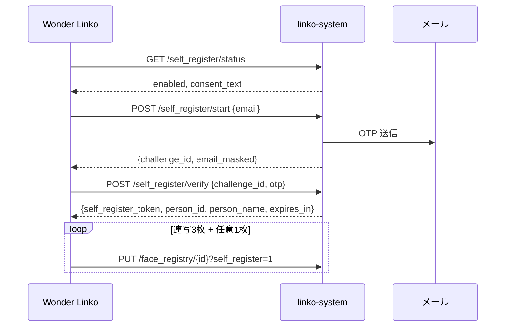

# 指示書: 顔セルフ登録 Phase 1（メール OTP + デスクトップ）

作成: 2026-06-01 / 対象: **linko-system**（API・設定）+ **wl_desktop_app**（UI）  
前提: 顔複数枚登録（連写3枚＋眼鏡追加）は v3.7.5 で管理者経路に実装済み。本 Phase 1 は**一般社員が自分の PC から同じ撮影 UX で登録**できるようにする。

## 背景・目的

現状、顔登録は **管理者 PC**（`linko_admin_token` + `face_registry_manage`）または **linko `/manager`** のみ。  
一般社員の PC には admin トークンを配布できないため、**本人確認付きの別認証経路**が必要。

Phase 1 のゴール:

1. 社員が Wonder Linko 設定から「自分の顔を登録」を開始できる（機能フラグ ON 時のみ）
2. **社内メール + ワンタイムパスワード（OTP）** で本人確認
3. 確認後に発行された **短期トークン** で、**自分の `person_id` に対する顔 PUT のみ**許可
4. 撮影 UX は管理者と同じ（連写3枚 → 眼鏡追加確認 → 任意1枚）

音声セルフ登録・Web 版・エントランス UI・Board OAuth 連携は **Phase 2 以降**（本書スコープ外）。

---

## 全体フロー

```
[社員 PC] 設定 →「自分の顔を登録」
    → 同意チェック
    → メール入力 → POST /self_register/start
    → OTP 入力   → POST /self_register/verify → self_register_token
    → FaceCaptureDialog 連写3枚
    → PUT /face_registry/<id>?self_register=1 （各枚、トークン付き）
    → 眼鏡追加確認 → 任意で1枚モード再撮影
    → 完了
```



---

## 設計原則

| 原則 | 内容 |
| ------ | ------ |
| オプトイン | サーバ `self_face_registration.enabled` + クライアント `face_registry_self`、いずれも既定 **OFF** |
| admin トークン不要 | 社員 PC の `config.json` に `linko_admin_token` は置かない |
| 最小権限 | トークンは **当該 person の顔 PUT のみ**。他者・DELETE・PATCH・POST は不可 |
| 社内ネットワーク | 既存 `_ip_allowed`（LAN / `LINKO_ADMIN_ALLOW_IPS`）を流用 |
| 撮影の再利用 | `FaceCaptureDialog` / `upload_faces_serial` のロジックを共有（新規実装は認証ウィザードのみ） |

---

## バックエンド API 仕様（linko-system 新規・変更）

ベース URL: `{linko_server_url}/api/face_registry`

既存の顔 PUT 挙動（embedding 追記・最大5件 FIFO・gallery 退避）は **変更しない**。認証分岐のみ追加する。

### 設定参照

`business_settings.json`（`load_business_settings_file`）に以下を追加。`/admin` の業務設定 UI にトグルを追加する。

```json
{
  "self_face_registration": {
    "enabled": false,
    "otp_required": true,
    "otp_ttl_seconds": 600,
    "otp_length": 6,
    "otp_max_attempts": 3,
    "token_ttl_seconds": 900,
    "staff_only": true,
    "consent_text_ja": "登録する顔画像は、入退室・執務室モード等での本人確認のために利用されます。…",
    "rate_limit_per_email_per_hour": 5,
    "rate_limit_per_ip_per_hour": 20
  }
}
```

| キー | 既定 | 説明 |
| ------ | ------ | ------ |
| `enabled` | `false` | 機能マスタースイッチ |
| `otp_required` | `true` | `false` のときは start 直後にトークン発行（開発用。本番は true 推奨） |
| `otp_ttl_seconds` | `600` | OTP 有効期限（10分） |
| `otp_max_attempts` | `3` | challenge あたりの OTP 試行上限 |
| `token_ttl_seconds` | `900` | `self_register_token` 有効期限（15分） |
| `staff_only` | `true` | `is_staff=false` の person はセルフ登録不可 |
| `consent_text_ja` | （文言） | クライアントが表示する同意文 |
| `rate_limit_*` | 上記 | メール/IP 単位の start 回数制限 |

**OTP 送信**: Phase 1 では linko 側に SMTP 設定を追加するか、既存のメール送信基盤があれば流用。未設定時は `start` が `503` を返し、管理者に設定を促す（サイレント失敗にしない）。

---

### `GET /api/face_registry/self_register/status`

セルフ登録 UI の初期表示用。**認証不要**（IP 制限のみ）。

**Response 200**

```json
{
  "enabled": true,
  "otp_required": true,
  "consent_text_ja": "…",
  "max_embeddings_hint": 5
}
```

`enabled: false` のときも 200 で返す（クライアントはボタンを無効化）。

---

### `POST /api/face_registry/self_register/start`

OTP 送信（または challenge 作成）を開始する。

**前提チェック（順）**

1. `self_face_registration.enabled`
2. `_ip_allowed(client_ip)`
3. レート制限（email / IP）
4. `email` 形式妥当
5. `GET /api/face_registry/lookup?email=` 相当で person 存在
6. `staff_only` 時は `is_staff === true`

**Request**

```json
{
  "email": "tanaka@example.com"
}
```

**Response 200（常に同形 — メール列挙対策）**

```json
{
  "ok": true,
  "challenge_id": "uuid-v4",
  "email_masked": "t***@example.com",
  "otp_ttl_seconds": 600,
  "message": "登録可能な場合、メールに確認コードを送信しました。"
}
```

- person が存在しない・staff_only 違反・レート制限でも **同じ 200 応答**（OTP は送らない、challenge は無効化または即失効）
- 内部ログにのみ理由を記録

**Response 403** — IP 不許可  
**Response 503** — 機能 OFF または OTP 送信基盤未設定

---

### `POST /api/face_registry/self_register/verify`

OTP を検証し、`self_register_token` を発行する。

**Request**

```json
{
  "challenge_id": "uuid-v4",
  "otp": "123456"
}
```

**Response 200**

```json
{
  "ok": true,
  "self_register_token": "<signed-token>",
  "person_id": "uuid",
  "person_name": "田中 太郎",
  "has_face": false,
  "expires_in": 900
}
```

| フィールド | 説明 |
|------------|------|
| `has_face` | 既に顔ありなら UI で「追加登録」文言に切替 |
| `self_register_token` | 以降の PUT に付与。署名は `URLSafeTimedSerializer`、salt は entrance 用と別（例: `linko-self-face-register-v1`） |

**Response 403** — OTP 不正・期限切れ・試行超過・challenge 無効  
**Response 429** — 試行回数超過

**トークン payload（署名前）**

```json
{
  "p": "<person_id>",
  "scope": ["face_put"],
  "challenge_id": "<uuid>"
}
```

---

### `PUT /api/face_registry/<person_id>?self_register=1`（既存エンドポイント拡張）

顔 data URL を登録。既存の admin 経路・`entrance_register` 経路に加え、第3の認証分岐を追加する。

**認証（いずれか1つ — 既存維持 + 新規）**

| 経路 | 条件 |
| ------ | ------ |
| 管理者 | `_ip_allowed` + `_token_check_passes()`（現状どおり） |
| エントランス再登録 | `?entrance_register=1` + PIN + `verification_token` + **hasFace 必須**（現状どおり） |
| **セルフ登録（新規）** | `?self_register=1` + 有効な `self_register_token` + URL の `person_id` がトークンと一致 |

**セルフ登録時のヘッダ（推奨）**

```
X-Linko-Self-Register-Token: <self_register_token>
```

body に `"self_register_token": "..."` でも可（ヘッダ優先）。

**Request body**（既存と同じ）

```json
{
  "faceData": "data:image/jpeg;base64,..."
}
```

**Response** — 既存 PUT と同じ（200 + person サマリ）。embedding 追記ロジックは共通。

**セルフ登録で拒否する操作**

- 他者の `person_id` への PUT → 403
- DELETE / PATCH / POST → 従来どおり admin のみ（セルフトークンでは不可）
- トークン期限切れ → 401
- `self_face_registration.enabled === false` → 403

**トークン失効（推奨）**

- オプション A: 有効期限内は複数枚 PUT 可能（連写3枚に必要）— **Phase 1 はこちら**
- オプション B: 初回 PUT 後に失効 — 連写と相性が悪いため Phase 1 では採用しない

---

### 監査ログ

`self_register/start`・`verify` 成功・各 `PUT ?self_register=1` 成功時にサーバログまたは専用監査テーブルへ記録する。

最低限のフィールド:

```
ts, person_id, email_hash, client_ip, action, embedding_count_after, user_agent
```

`action` 例: `self_register_start` | `self_register_verify_ok` | `self_register_face_put`

既存 `FaceConsentLog` と統合できるなら `decision=granted`, `method=self_register_desktop` で追記。

---

## デスクトップアプリ仕様（wl_desktop_app）

### 機能フラグ

`config.json` → `features.face_registry_self`（既定 `false`）

`config_loader.py` の `DEFAULT_FEATURES` に追加。

設定画面（`settings_dialog.py`）の `_FEATURES` に項目追加:

| key | ラベル | 説明 |
|-----|--------|------|
| `face_registry_self` | 自分の顔を登録 | 社内メールで本人確認後、自分の顔を登録します。要: linko 名簿にメール登録済み・社内ネットワーク。 |

**`linko_admin_token` は不要。** `linko_server_url` は必須。

### 新規ファイル

| ファイル | 役割 |
|----------|------|
| `face_registry_self_client.py` | `get_status`, `start`, `verify`, `update_face_self` |
| `face_registry_self_dialog.py` | ウィザード UI（下記ワイヤー） |

### 既存ファイルの変更

| ファイル | 変更内容 |
| ---------- | ---------- |
| `settings_dialog.py` | フラグ +「自分の顔を登録…」ボタン |
| `face_registry_admin_dialog.py` | （任意）`FaceCaptureDialog` を import 可能なまま維持。アップロード完了・眼鏡プロンプトを共通関数化して self からも呼ぶ |
| `face_registry_client.py` | 変更なし（admin 専用のまま）。self 用は別クライアント |

### クライアント API ラッパー（`face_registry_self_client.py`）

```python
def get_self_register_status(cfg: dict) -> dict: ...
def start_self_register(cfg: dict, email: str) -> dict: ...
def verify_self_register(cfg: dict, challenge_id: str, otp: str) -> dict: ...
def update_face_self(cfg: dict, person_id: str, token: str, face_data_url: str) -> dict: ...
def upload_faces_self_serial(cfg, person_id, token, urls) -> tuple[int, int, Optional[str]]: ...
```

`update_face_self` は `PUT {base}/api/face_registry/{id}?self_register=1` に  
`X-Linko-Self-Register-Token` を付与。`security.validate_http_url` を流用。

---

## 画面ワイヤー（デスクトップ）

共通: CustomTkinter トップレベル、`attributes("-topmost", True)`、幅 480〜520px。

---

### 画面 0: 入口（設定ダイアログ内）

```
┌─ Wonder Linko 設定 ─────────────────────────┐
│  …                                          │
│  機能 (任意でON)                            │
│  ☐ 自分の顔を登録                           │
│                                             │
│  [ 自分の顔を登録… ]  ← face_registry_self  │
│                         が ON のとき有効    │
│  …                                          │
│  [保存]  [キャンセル]                       │
└─────────────────────────────────────────────┘
```

- ボタン押下で `FaceSelfRegisterDialog` を開く
- 事前に `GET self_register/status` を呼び、`enabled=false` なら  
  「管理者がセルフ登録を有効にしていません」と表示して終了

---

### 画面 1: 説明 + 同意

```
┌─ 自分の顔を登録 ────────────────────────────┐
│                                             │
│  入退室・執務室モードなどで使う顔データを     │
│  登録します。                                 │
│                                             │
│  ┌─────────────────────────────────────┐   │
│  │ （consent_text_ja をスクロール表示）  │   │
│  └─────────────────────────────────────┘   │
│                                             │
│  ☐ 上記に同意して登録を続ける               │
│                                             │
│  撮影は連写3枚です。照合データは最大5件。     │
│                                             │
│              [キャンセル]  [次へ →]         │
│                           （同意ON時のみ）   │
└─────────────────────────────────────────────┘
```

---

### 画面 2: メール入力

```
┌─ 本人確認（1/2）────────────────────────────┐
│                                             │
│  社内名簿に登録されているメールアドレスを     │
│  入力してください。確認コードを送信します。   │
│                                             │
│  メールアドレス                              │
│  ┌─────────────────────────────────────┐   │
│  │ tanaka@example.com                    │   │
│  └─────────────────────────────────────┘   │
│  ※ Board ログイン済みならメールをプリフィル  │
│                                             │
│  ステータス: （空）                          │
│                                             │
│              [← 戻る]  [コードを送信]        │
└─────────────────────────────────────────────┘
```

- `POST start` 成功後、画面 3 へ
- エラー時も「送信しました」系メッセージを優先（列挙対策と整合）

---

### 画面 3: OTP 入力

```
┌─ 本人確認（2/2）────────────────────────────┐
│                                             │
│  t***@example.com に送信した6桁のコードを     │
│  入力してください。                           │
│                                             │
│  確認コード                                  │
│  ┌─────────────────────────────────────┐   │
│  │  ● ● ● ● ● ●                        │   │
│  └─────────────────────────────────────┘   │
│                                             │
│  残り時間: 9:42                              │
│                                             │
│  [コードを再送信]                            │
│                                             │
│              [← 戻る]  [確認]               │
└─────────────────────────────────────────────┘
```

- `POST verify` 成功 → `self_register_token` / `person_id` / `person_name` を保持 → 画面 4 へ
- 失敗: 「コードが正しくありません」（試行残数があれば表示）

---

### 画面 4: 撮影（既存 `FaceCaptureDialog` をそのまま使用）

```
┌─ 顔を撮影 — 田中 太郎（連写3枚）────────────┐
│  「撮影して登録」で自動連写3枚します。        │
│  各枚の前にカウントダウンがあります。       │
│ ┌─────────────────────────────────────┐    │
│ │         （カメラプレビュー）          │    │
│ └─────────────────────────────────────┘    │
│  少しだけ左を向いてください … 2              │
│                                             │
│ [撮影して登録] [画像ファイルを選択] [キャンセル]│
└─────────────────────────────────────────────┘
```

- `burst_count=3`、`on_captured` → `upload_faces_self_serial`
- ファイル選択は **1枚のみ**（管理者経路と同様）。眼鏡プロンプトは3枚バースト成功時のみ
- 完了メッセージは管理者と同型（`○○の顔を3枚登録しました` / 部分成功）

---

### 画面 5: 眼鏡追加（既存 messagebox）

```
┌─ 追加撮影 ─────────────────────────────────┐
│  眼鏡をかけて撮影した場合、外した状態でもう   │
│  1枚追加すると認識率が上がります。           │
│  追加撮影しますか？                          │
│                                             │
│              [いいえ]    [はい]              │
└─────────────────────────────────────────────┘
```

「はい」→ `FaceCaptureDialog(burst_count=1)` を再表示（トークンは同一セッション内で有効）

---

### 画面 6: 完了

```
┌─ 登録完了 ─────────────────────────────────┐
│                                             │
│  田中 太郎 さんの顔を登録しました。          │
│  照合データは管理者画面で N/5 と確認できます。│
│                                             │
│                        [閉じる]             │
└─────────────────────────────────────────────┘
```

---

## 実装タスク一覧

### linko-system

| # | タスク |
| --- | -------- |
| L1 | `business_settings` に `self_face_registration` 追加 + 正規化 |
| L2 | `/admin` 業務設定 UI（有効化・同意文・OTP 設定） |
| L3 | OTP チャレンジストア（メモリ or Redis。単一インスタンスならメモリで可） |
| L4 | OTP メール送信（SMTP 設定 or 既存基盤） |
| L5 | `GET /self_register/status` |
| L6 | `POST /self_register/start`（列挙対策・レート制限） |
| L7 | `POST /self_register/verify` + トークン発行 |
| L8 | `PUT ?self_register=1` 分岐 + ヘッダ検証 |
| L9 | 監査ログ |
| L10 | 単体テスト（トークン不一致・期限切れ・staff_only・IP 拒否） |

### wl_desktop_app

| # | タスク |
| --- | -------- |
| D1 | `features.face_registry_self` + 設定 UI |
| D2 | `face_registry_self_client.py` |
| D3 | `face_registry_self_dialog.py`（画面 1〜3, 6） |
| D4 | 撮影・アップロード・眼鏡プロンプト接続（`FaceCaptureDialog` 再利用） |
| D5 | Board ログイン済みメールのプリフィル（`board_system` 経由の email が取れなければ手入力のみ） |
| D6 | `version.py` bump（例: v3.8.0） |
| D7 | 手動受け入れテスト（下記） |

---

## やらないこと（Phase 1 スコープ外）

- 音声セルフ登録
- Web `/self-register` ページ
- Board System Google OAuth による OTP 省略
- エントランス `ReceptionFloatActions` の顔登録スタブ実装
- 管理者招待リンク方式（Phase 1b 候補として別指示書可）
- クライアント側の顔検出品質チェック（ガイダンス文言のみ）
- 社員の新規名簿作成（セルフ登録は **既存 person 必須**。未登録者は管理者が Workspace 同期 or `/manager` で追加）

---

## 受け入れ基準

1. **機能 OFF** 時、設定のボタンまたはサーバ応答で「利用不可」と分かる
2. admin_token **なし**の社員 PC から、メール OTP 後に連写 **3枚** 登録でき、`/manager` で該当者が「照合データ 3/5」になる
3. 眼鏡追加で **4/5** まで増える
4. **他人の person_id** に PUT できない（トークン改ざんで 403）
5. **未登録メール** で start しても、攻撃者にメール存在が漏れない（応答は常に同形）
6. 社外 IP からは start/verify/PUT が拒否される
7. 管理者経路（`face_registry_manage` + admin_token）は **従来どおり** 動作する
8. 既に5件の社員が追加してもエラーにならず FIFO で頭打ち

---

## テスト観点（手動）

| # | 手順 | 期待結果 |
| --- | ------ | ---------- |
| T1 | フラグ OFF でボタン | 案内メッセージで終了 |
| T2 | 名簿未登録メールで start | 200 同形、OTP は届かない |
| T3 | 正しいメール + OTP | verify 成功、撮影へ |
| T4 | 誤 OTP 3回 | 429/403、再 start が必要 |
| T5 | 連写3枚 | 3/5 表示 |
| T6 | 眼鏡追加1枚 | 4/5 |
| T7 | トークン期限切れ後に PUT | 401、再 verify を促す |
| T8 | 管理者が同社員を追加撮影 | 従来 admin 経路で問題なし |

---

## 参考: 関連ファイル

### linko-system（新規・変更）

- `src/webapp/routes/api_face.py` — エンドポイント追加・PUT 分岐
- `src/webapp/services/business_hours_service.py` — settings 正規化
- `src/webapp/static/js/admin-business-settings.js` — admin UI
- `src/webapp/services/auth.py` — `_ip_allowed` 流用
- `src/webapp/face_registry_storage.py` — `get_person_by_email`（既存）

### wl_desktop_app（新規・変更）

- `face_registry_self_client.py` — **新規**
- `face_registry_self_dialog.py` — **新規**
- `face_registry_admin_dialog.py` — `FaceCaptureDialog`（再利用）
- `face_registry_client.py` — admin 専用（変更なし）
- `settings_dialog.py` / `config_loader.py`
- `webcam_capture.py` — 変更なし

### 既存ドキュメント

- `docs/指示書_顔複数登録対応.md` — 撮影 UX・PUT 挙動の前提

---

## バージョン・リリース

- linko-system と wl_desktop_app は **セットでデプロイ**（API 先行または同時）
- デスクトップ: `version.py` を Phase 1 完了時に bump（例: **v3.8.0**）
- 運用: `/admin` で `self_face_registration.enabled` を ON にしてから、各 PC で `face_registry_self` を ON
